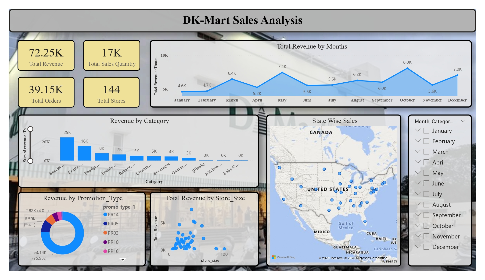
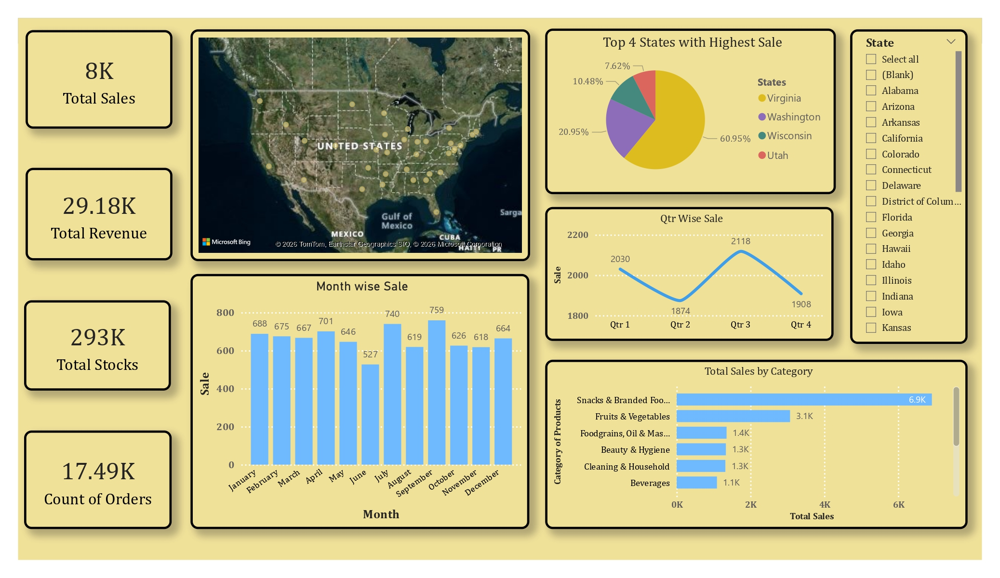

# 🛒 DK-Mart Sales Analysis Dashboard

## 📌 Project Overview
Interactive **Power BI** dashboards analyzing DK-Mart retail sales. Explore revenue trends, product category performance, regional sales distribution, and promotion impact. Turns raw sales data into actionable insights quickly.

## 📊 Dashboards

### Dashboard 1 — Sales Performance Overview

**Key Metrics:**  
- Total Revenue: 72.25K  
- Total Orders: 39.15K  
- Total Sales Quantity: 17K  
- Total Stores: 144  

**Highlights:**  
- Monthly revenue trends  
- Product category comparison  
- State-wise sales distribution  
- Promotion impact  
- Store size vs revenue  

### Dashboard 2 — Category & Regional Insights

**Key Metrics:**  
- Total Sales: 8K  
- Total Revenue: 29.18K  
- Total Stocks: 293K  
- Total Orders: 17.49K  

**Highlights:**  
- Category-wise sales comparison  
- Monthly & quarterly trends  
- Geographic sales distribution  
- Top performing states  

## 🛠 Tools & Skills
- Power BI  
- Excel / Dataset  
- Data visualization, dashboard design, KPIs, interactive filters  

## 📈 Insights
- Top categories drive most revenue  
- Sales vary seasonally  
- Few states contribute major sales  
- Promotions affect revenue  
- Store size correlates with sales
